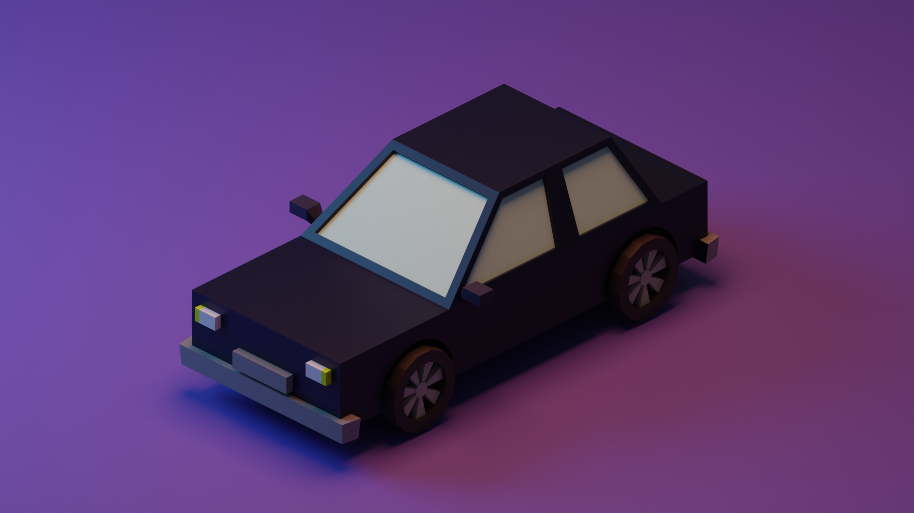
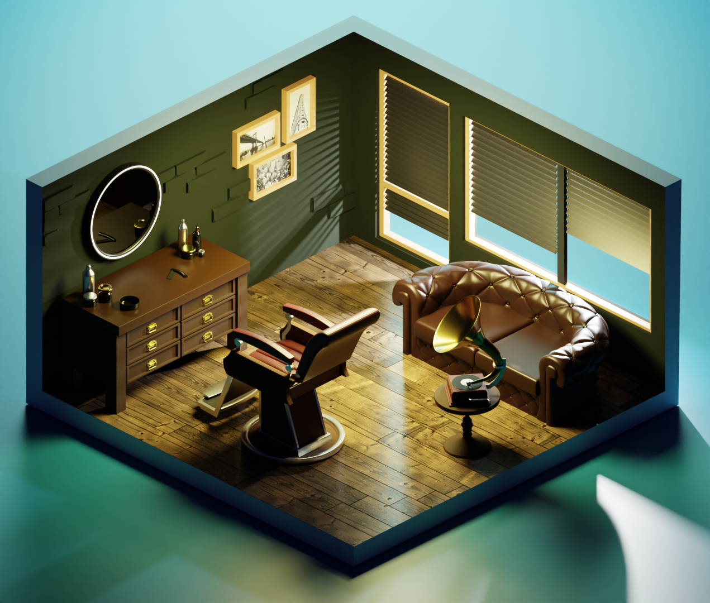

## One of my most enjoyable experiences

Blender is one of the animation design tools that can meet the needs of an animator from beginner to advanced.

My personal experience with this program dates back to the quarantine period of the corona virus, when I started working with it at the suggestion of one of my friends.

Learning this art like anything else in today's age is possible through the internet.

You can use courses and tutorials to learn more in places like YouTube, and you can get new and interesting ideas from apps like Instagram.

With Blender, you can start with something as simple as a toy car made just by reshaping a cube, and work your way up to bigger things like animating and lighting up a real Porsche on the highway.

This was my first experience working with Blender, which happened during one of the online classes:

And after a few months I came to something like this:

As I said, to start, you can use YouTube channels like the one I put below.

This channel has been the best teacher I have ever had XD

[You can use this link to start an amazing experience](https://www.youtube.com/@polygonrunway)

Finally, you can see some of the other projects I've built on this platform in the gallery section of this website.